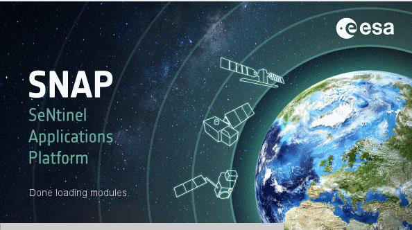

<h1>Introducción al uso de imágenes de Radar de Apertura Sintética aplicado a la agricultura</h1> 
<h2>Manual de cálculo de humedad de suelo</h2> 

Este manual fue elaborado por la Escuela de Geografía de la Universidad de Costa Rica, para el cual colaboraron Emmanuel Jesús Céspedes-Rivera y Cristian Aguilar-Barboza en calidad de asistentes avanzados del proyecto "Transformación digital: Incorporación de tecnología SAR en la gestión de riesgos, agricultura y recursos naturales para Centroamérica", en el marco del proyecto UCREA-IICA.

Este proyecto está coordinado por el Dr Edgar Espinoza Cisneros y co-cordinado por MSc María José Molina Montero. Para mayor información contactar a maria.molinamontero@ucr.ac.cr .

Índice
 

<li><a href="#Sección1">1. Prerrequisitos</a></li>
<li><a href="#Sección2">2. Introducción</a></li>
<li><a href="#Sección3">3. Procesamiento y análisis</a></li>
<li><a href="#Sección4">4. Librería Soil Moisture</a></li>
<li><a href="#Sección5">5. Estimación Humedad de suelo</a></li>
<li><a href="#Sección6">6. Recomendaciones</a></li>
<li><a href="#Sección7">7. Bibliografía</a></li>
 

<h2 id="Sección1">1. Prerrequisitos</h2>

Para ejecutar esta rutina el usuario debe instalar previamente el software Sentinel Toolbox (SNAP), el cual es un software de procesamiento para el análisis y observación de la tierra, con herramientas enfocadas en extensibilidad de datos, portabilidad, procesamiento en marcos gráficos, entre otras herramientas (ESA, 2020).

<h4 id="Sección3">Fig. 1. Sentinel Toolbox (SNAP).</h4>

La descarga del software SNAP se puede realizar en la siguiente dirección electrónica
 

<a href="http://step.esa.int/main/download/snap-download/" target="_blank">http://step.esa.int/main/download/snap-download/</a>
 

Los requisitos computacionales mínimos son:
<li>Sistema operativo: Linux, Mac, Windows.</li>
<li>RAM: 8 GB Procesador Intel® Core™ i5-5 o sus equivalentes.</li>
<li>Espacio en disco mínimo 5GB</li>

<h2 id="Sección2">2. Introducción</h2>

La humedad del suelo es un parámetro clave en la regulación del ciclo del agua en la tierra, ya que está en función de las tasas de evaporación y precipitación sobre el suelo, por lo tanto, la disponibilidad de agua en el suelo es esencial para estudios en agricultura, hidrología, meteorología, entre otras (Alexakis et al., 2017). Las imágenes Radar de Apertura Sintética (SAR por sus siglas en inglés) de Sentinel-1, tienen el potencial de estimar de forma indirecta la humedad de suelo debido a características de resolución espacial, temporal y polarización.

La detección remota con sensores ópticos requieren de observaciones con productos de buena calidad, libre de nubes o sombras de nubes para minimizar la confusión espectral de los datos (Shen et al., 2019), sin embargo, en zonas tropicales las coberturas nubosas son constantes y abundantes, su aplicación resulta limitada (Flores et al., 2019). Debido a este aspecto, se ha implementado el uso de la imágenes SAR, la cual despeja la limitante de la nubosidad y permite la obtención continua de información (Flores et al., 2019).

En este caso se aplicó una metodología para la detección de humedad de suelo basada en dos imágenes, una en órbita ascendente y otra en órbita descendente, con una diferencia temporal de aproximada de 12 horas. Lo anterior, con el objetivo de evitar cambios abruptos en las condiciones humedad de la superficie. Por otro lado, se utilizó la polarización VV, ya que el algoritmo IEM (Inversión de ángulo múltiple), no permite procesar imágenes con polarizaciones cruzadas. La ejecución de esta rutina requiere utilizar el software Sentinel Toolbox (SNAP), el cual contiene la librería Soil Moisture, elaborada por la Agencia Espacial Europea (ESA por sus siglas en inglés). Se consideró como área de estudio un sector de la cuenca del río Tempisque, en el que prevalecen cultivos como caña y arroz, así como la presencia de pastos.

<h3>1.1 Objetivos de aprendizaje:</h3>

<li>Comprender los pre-procesos de calibración de las imágenes SAR.</li>
<li>Describir los procesos de interacción de la señal SAR con la superficie terrestre.</li>
<li>Identificar ventajas y desventajas del uso de imágenes SAR en la detección de humedad de suelo, a partir de la librería Soil Moisture.</li>
<li>Generar un mapa de humedad de suelo para la parte baja de la cuenca del río Tempisque.</li>

<h3>1.2 Datos a dercargar</h3>

Se deben descargar dos imágenes de tipo GRD de Sentinel-1, estas se pueden obtener de forma gratuita en los siguientes enlaces:

Para ambos casos (Alaska Satellite Facility Vertex y Copernicus Open Access Hub) debe crear -en caso de no tenerse- una cuenta de acceso, para poder descargar datos de información satelital de los repositorios.

<h4>Alaska Satellite Facility Vertex</h4> 

Buscador de datos:
<a href="https://search.asf.alaska.edu/#/" target="_blank">https://search.asf.alaska.edu/#/</a>

Registro de cuenta:
<a href="https://urs.earthdata.nasa.gov/users/new" target="_blank">https://urs.earthdata.nasa.gov/users/new</a>

<h4>Copernicus Open Access Hub</h4>  

Buscador de datos:
<a href="https://scihub.copernicus.eu/dhus/#/home" target="_blank">https://scihub.copernicus.eu/dhus/#/home</a>

Registro de cuenta:
 <a href="https://scihub.copernicus.eu/dhus/#/self-registration" target="_blank">https://scihub.copernicus.eu/dhus/#/self-registration</a>

Por otro lado, se deben descargar los archivos correspondientes a contenido de arcillas y arenas (en los primeros 5 cm del suelo), mediante la base de datos SoilGrids:
SoilGrids

<a href="https://soilgrids.org/" target="_blank">https://soilgrids.org/</a>

SoilGrids es un repositorio con información global consistente, basado en datos, que predice las propiedades y clases de los suelos utilizando co-variables y modelos ajustados globalmente (ISRIC, 2020).

<h2>Conjunto de datos</h2>

<table style="width:100%">
  <tr>
    <th>Nombre del producto</th>
    <th>Fecha</th> 
    <th>Características</th>
  </tr>
  <tr>
    <td>S1A_IW_GRDH_1SDV_20200130T113040_20200130T113105_031029_03907C_E4A5</td>
    <td>2020/01/30</td>
    <td>
Sentinel-1A

Polarización VV, VH

Órbita: Descendente

Modo: IW

Tipo: GRDH
</td>
  </tr>
  <tr>
    <td>S1A_IW_GRDH_1SDV_20200130T235649_20200130T235714_031037_0390C2_5BF4</td>
    <td>2020/01/30</td>
    <td>
Sentinel-1A

Polarización VV, VH

Órbita: Descendente

Modo: IW

Tipo: GRDH
</td>
  </tr>
</table>

